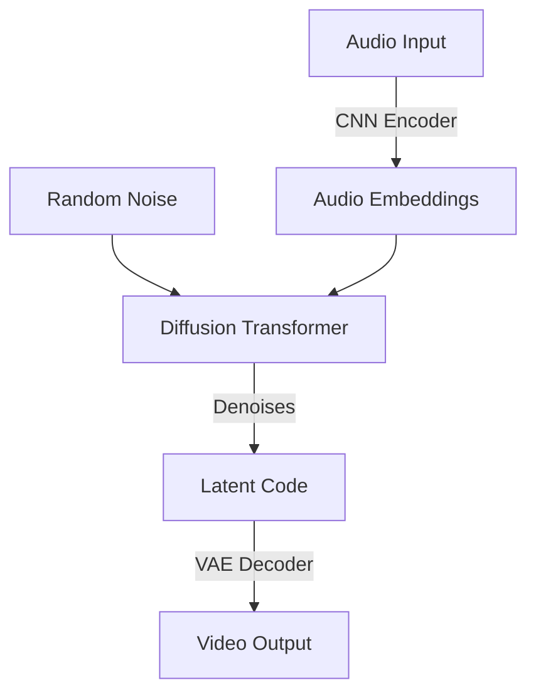

# Model Architecture

## Overview

Synesthete uses a **Latent Diffusion** architecture. This approach separates the problem into two distinct stages: **Compression** (Seeing) and **Generation** (Imagining).

This solves the "Regression to the Mean" problem where direct regression models produce blurry, gray outputs by averaging all possible valid images.

## Architecture Diagram



## Component 1: Spatial VAE ("The Eye")

The Variational Autoencoder (VAE) learns to compress high-dimensional video frames into low-dimensional latent representations.

*   **Input**: 128x128x3 RGB Images
*   **Encoder**: Fully Convolutional CNN (Downsamples 128 -> 64 -> 32 -> 16 -> 8)
*   **Latent Space**: **8x8x256** Spatial Grid (Not a flat vector!)
    *   *Why Spatial?* Preserving the 2D grid structure allows the diffusion model to generate coherent shapes and textures much better than a 1D vector.
*   **Decoder**: Fully Convolutional CNN (Upsamples 8 -> 128)
*   **Loss**: MSE Reconstruction + KL Divergence (0.1 weight)

## Component 2: Diffusion Transformer ("The Brain")

The Diffusion Model learns to generate valid latent codes from random noise, conditioned on audio.

*   **Backbone**: Transformer Decoder (Standard PyTorch implementation)
*   **Input**:
    *   Noisy Latents (8x8x256) flattened to sequences
    *   Time Step Embedding (Sinusoidal)
    *   Audio Embeddings (from Audio Encoder)
*   **Conditioning**: Cross-Attention to Audio Embeddings
*   **Objective**: Predict the noise added to the latents (DDPM objective)
*   **Sampling**: Iterative denoising (50 steps)

## Legacy Model (Deprecated)

The original `AudioToVideoNet` (Hybrid CNN+Transformer regression) is preserved in `src/model.py` for reference but is no longer the active architecture.

### Legacy Architecture
```
Audio -> CNN Encoder -> Transformer -> CNN Decoder -> Pixels
```
This model suffered from severe blurring due to the multimodal nature of the dataset (one sound -> many possible visuals).
