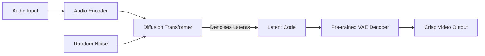

# Roadmap: Latent Diffusion for Creative Synthesis

## The Problem: "Gray Sludge" (Regression to the Mean)

Our initial experiments with a direct Audio-to-Pixel regression model revealed a fundamental limitation known as **Regression to the Mean**.

*   **The Cause**: We trained a deterministic model (MSE Loss) on a multimodal dataset (Randomized Visualizers).
*   **The Effect**: When the model encounters a sound that could map to multiple valid visual outputs (e.g., a Red Circle OR a Blue Square), it minimizes error by predicting the mathematical average of all possibilities.
*   **The Result**: The output becomes a low-contrast, gray, blurry "sludge" that lacks distinct shape or color.

## The Solution: Latent Generative Modeling

To enable the model to make "creative" choices (hallucinating specific, sharp visuals that represent a hybrid of concepts) rather than "safe" choices (averaging pixels), we are moving to a **Latent Diffusion** architecture.

This approach separates the problem into two distinct stages: **Compression** (Seeing) and **Generation** (Imagining).

### Architecture Overview

1.  **The Eye (VAE Autoencoder)**:
    *   **Role**: Learns to compress 128x128 images into compact "Latent Codes" (8x8x256) and reconstruct them perfectly.
    *   **Benefit**: It acts as a "Cleanup Crew." It refuses to generate sludge; it only knows how to generate valid, sharp geometric shapes from the training distribution.
    *   **Status**: Implemented (`src/vae.py`) and training (`src/train_vae.py`).

2.  **The Brain (Diffusion Transformer)**:
    *   **Role**: Instead of predicting pixels, it predicts **Latent Codes**.
    *   **Mechanism**: It takes random noise and "denoises" it, conditioned on the audio features.
    *   **Benefit**: Because it starts with noise, it can probabilistically pick *one* valid path (e.g., "I will make a Red Circle") rather than averaging all paths. This allows for true novelty and "hallucination" of new visualizer concepts.
    *   **Status**: **Next Step.**

## Implementation Plan

### Phase 1: VAE (The Foundation) - ✅ DONE
- [x] Define VAE Architecture (`src/vae.py`).
- [x] Create VAE training loop (`src/train_vae.py`).
- [x] Train VAE to reconstruct `Pulse`, `Spectrum`, and `Waveform` visualizers.

### Phase 2: Diffusion Transformer (The Generator) - ✅ DONE
- [x] Create `DiffusionTransformer` model class.
    - Input: Noisy Latents + Audio Embeddings.
    - Output: Predicted Noise (or Denoised Latent).
- [x] Implement Diffusion Noise Scheduler (DDPM or DDIM).
- [x] Create `train_diffusion.py`.
    - Freezes the VAE.
    - Encodes ground-truth video into latents.
    - Adds noise to latents.
    - Trains Transformer to remove noise based on audio.

### Phase 3: Inference & Sampling - ✅ DONE
- [x] Implement Sampling Loop.
    - Start with pure Gaussian noise.
    - Iteratively denoise using Audio conditioning.
    - Decode final latent using VAE.
